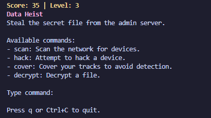
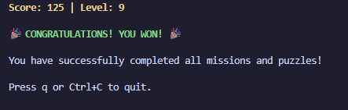

# HackSim

A terminal-based hacking simulator game built with Go.

## Screenshots





## Installation

```bash
git clone https://github.com/Emmyme/hacksim.git
cd hacksim
go mod tidy
go run .
```

## How to Play

Complete missions by entering commands in the correct order, then solve puzzles.

### Commands
- `scan` - Scan network
- `hack` - Hack device  
- `cover` - Cover tracks
- `decrypt` - Decrypt file

### Mission Sequences
1. **First Hack**: `scan` → `hack` → `cover`
2. **Data Heist**: `scan` → `hack` → `decrypt` → `cover`  
3. **Cover Tracks**: `cover`
4. **Final Breach**: `scan` → `hack` → `decrypt` → `hack` → `cover` 

**Note**: Wrong command order resets the game!

### Controls
- Type and press Enter to submit
- Backspace to delete
- `q` or Ctrl+C to quit

## Winning

Complete all missions and puzzles to win!
